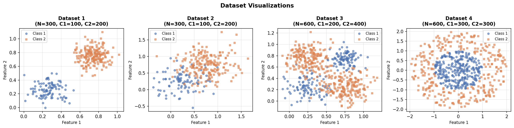
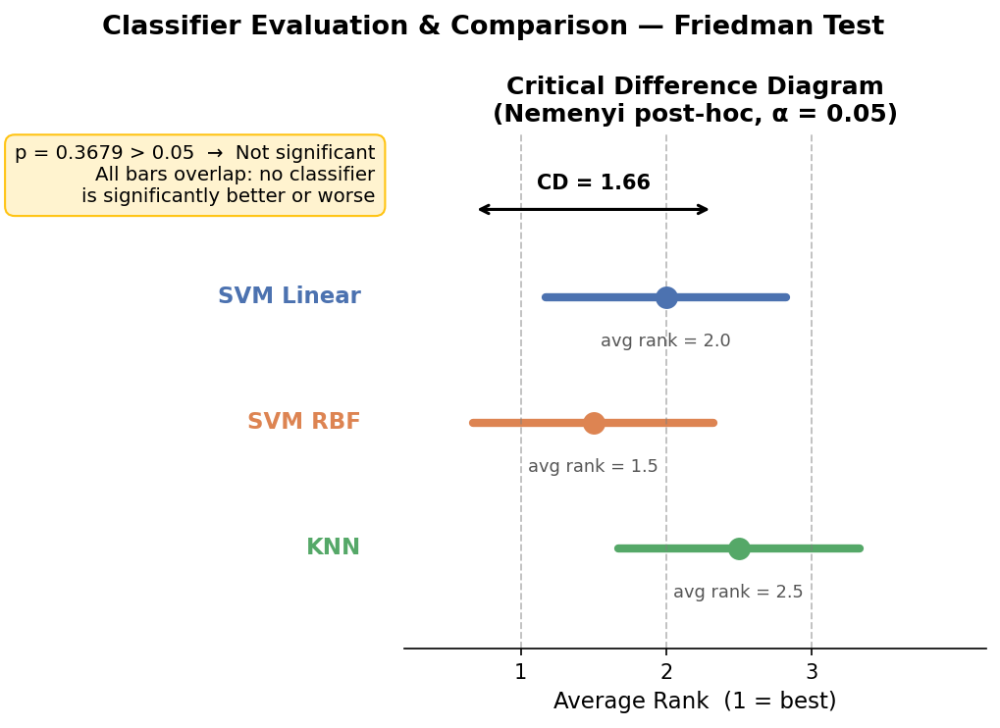

# Supervised Learning — Classifier Comparison

**Course:** Supervised Learning | Università degli Studi di Milano-Bicocca  
**Author:** Pallab Mondal (Matricola: 946804)  
**Date:** March 2026

---

## Overview

This project compares three supervised learning classifiers on four synthetic two-dimensional datasets using a rigorous **5×2 cross-validation** procedure, followed by a **Friedman test** with **Nemenyi post-hoc analysis** to assess statistical significance.

### Classifiers Evaluated
- **SVM (Linear kernel)** — strong on linearly separable data
- **SVM (RBF kernel)** — best overall generalization
- **K-Nearest Neighbors (KNN, k=5)** — competitive, non-parametric baseline

---

## Datasets

Four synthetic 2D datasets (`dataset1`–`dataset4`), each with two classes, varying levels of class overlap, and different decision boundary geometries.



---

## Methodology

- **5×2 Cross-Validation:** Each dataset is split into two stratified halves five times; training/test roles are swapped each round, and the mean accuracy is recorded per repetition.
- **Friedman Test:** Classifiers are ranked per dataset and a non-parametric test checks for statistically significant differences across all four datasets.
- **Nemenyi Post-hoc:** Critical Difference (CD ≈ 1.657) computed to identify which classifier pairs differ significantly.

---

## Results

### 5×2 CV Accuracy

| Classifier  | DS1    | DS2    | DS3    | DS4    |
|-------------|--------|--------|--------|--------|
| SVM Linear  | 1.0000 | 0.8793 | 0.6667 | 0.5780 |
| SVM RBF     | 1.0000 | 0.8687 | 0.9310 | 0.9753 |
| KNN         | 1.0000 | 0.8427 | 0.9207 | 0.9610 |

### Average Ranks (Friedman Test)

| Classifier  | Avg Rank |
|-------------|----------|
| SVM RBF     | **1.50** |
| SVM Linear  | 2.00     |
| KNN         | 2.50     |

**Friedman test p-value: 0.3679 (> 0.05)** — no statistically significant difference detected, likely due to the small number of datasets (N=4).



---

## Key Findings

- **SVM RBF** achieves the best average rank and is the most robust choice when the decision boundary geometry is unknown.
- **SVM Linear** performs perfectly on linearly separable data but degrades significantly on non-linear problems.
- **KNN** is competitive but slightly outperformed by SVM RBF overall.
- The lack of statistical significance highlights the importance of combining accuracy metrics with proper hypothesis testing — raw accuracy alone can be misleading.

---

## Files

| File | Description |
|------|-------------|
| `classifier_comparison.py` | Main Python script — runs experiments and generates figures |
| `report.pdf` | Full written report with methodology and analysis |
| `fig1_datasets.png` | Scatter plots of the four datasets |
| `fig2_results.png` | Critical difference diagram |

---

## Requirements

```bash
pip install numpy scikit-learn scipy matplotlib
```

---

## How to Run

```bash
python classifier_comparison.py
```

The script will load the datasets, run 5×2 CV for all classifiers, print the Friedman test result, and save both figures.
